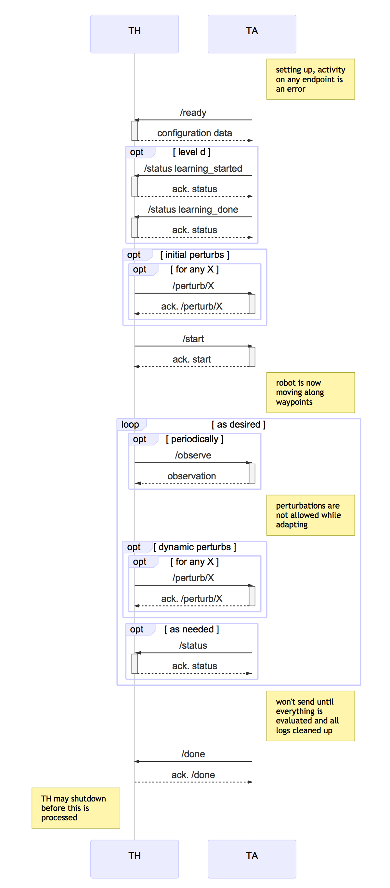

# CMU MARS (Aldrich), CP1: Integrated power model discovery and adaptation

## Overview

### Executive Summary

Modern software-intensive systems are typically composed of components that
are likely to change their behavior over time. For software to continue to operate under such changes, the assumptions about parts of the system made at design time may not hold at runtime after some point. Therefore, mechanisms must be put in place that can dynamically learn new models of these assumptions and use them to make decisions about missions, configurations, and in general, how to adapt the software systems at runtime for more optimal performance. The use of power in robotics systems is one of the characteristics of cyber-physical systems that

  1. is rarely used to reason about mission completion, but is typically
     critical for a mission's success,
  2. will change over time due to chemical and physical characteristics of batteries as they degrade and are replaced over time, and
  3. will change as sensors/algorithms/workloads evolve over the lifetime of
     the system.

Using power as an example model, the aim of this challenge problem is to

  1. apply learning techniques to discover new power models for a robotics
     system, and
  2. take advantage of these new models at run time to improve the quality
     of missions of the robot over the use of no or static models.

In this phase, we will restrict the problem to one where we learn the power
model `off-line` given a `limited learning budget`, but apply it on-line for planning the mission (i.e., we will not consider dynamically changing power models). Lincoln Labs will select models (from a predetermined set of possible models) for different energy consumption profiles of hardware and software components used by the robot (these models may not be faithful to
existing profiles, but may reflect future hardware and software energy
consumption characteristics). As a proxy for running physical experiments
to determine the power model, the MARS DAS will learn the model by querying
it within a predetermined number of times (note the learning budget is specified by Lincoln Labs). This learned power model is then used during robotic missions to improve the the quality (and better satisfy the intents) of the mission.


### Technical Summary

Mobile robotic systems are expected to perform a wide variety of long range, long term and complex missions, inherently with different characteristics. By contrast to industrial robotics where energy can be supposed to be infinite, the management of autonomous mobile robot missions requires to be able predicting the energy consumption of the robot with an acceptable accuracy. Moreover, the mission complexity and the environment versatility imposes to be able managing the embedded energy according to different robot configurations (sensors, actuators, computation intensive control algorithms, etc.), making the energy management a central issue for autonomous robotic missions.

The goal of this challenge problem is to discover the power model of the
mobile robotics platform and use the discovered model to adapt for optimal
mission performance. The intent of this challenge problem is to simulate
robots with different hardware, algorithms, and workload and therefore
different power usage characteristics, in which we also intentionally simulate
severe changes that might be caused by unanticipated and yet-unknown
future environment changes. This challenge problem tests whether we can
adapt our robotic platform successfully to such situations.

Lincoln Labs will select a secret power model which is a function of robot's configuration (speed, Kinect sensors, localization) and outputs energy consumption. That is, Lincoln Labs can provide drastic differences for energy consumption of hardware and software components that may not reflect
current but possibly distant-future hardware and software. The MARS DAS
will be able to query the model by providing inputs and receiving back
the output from the power model. In addition, the power model is used
during the evaluation to compute the battery level during simulation.

The challenge problem will proceed in two phases. First, the DAS will use
the query mechanism to query the power consumption for certain inputs
(simulating the idea of running experiments in practice to measure power
consumption in specific configurations). The DAS will query only a small
number of inputs until a query budget (specified by Lincoln Labs) is exhausted.
The DAS will use the information gleaned to learn an approximation of the
secret power model.

In the second phase, the robot will be asked to complete `n` tasks (part of a mission) within a map. There are charging stations on the map. The learned approximation of the power model is used by the adaptation logic, but the actual battery levels during the evaluation are computed with the secret power model provided by Lincoln Labs. In the baseline scenario, the MARS team will use no energy model at all, but rely on reactive planning to go to the charging station when it is needed. The robot would therefore not make effective planning decisions about when to recharge. The evaluation is based on observable differences in terms of (i) mission success/failures (e.g., running out of energy) and (ii) completion time (e.g., recharging more effectively with fewer disruptions to the mission).

### Research Questions

**RQ1**: Can adaptations that reason using *models that have been learned under budget constraint* improve the quality of missions (in terms of evaluation criteria including timeliness, success rate) compared to reactive adaptations?

+ We assume the learning is *under limited budget constraints*. Also, power models are assumed to be *polynomial models parameterized over robot's configuration options*.
+ There might be some cases where using an accurate model might tell us that we can finish a mission without going to the charge station and, therefore, we finish the the mission earlier (i.e., better in terms of timeliness).
+ We will explore corner cases that adaptation using a learned model can provide us benefit by saving time, saving energy or both, and therefore hitting a better score in total.
+ There might be some cases where reactive planner force the robot to the charging station, but we could finish the mission without going to the station.
+ We would also explore how the learning budget would affect the quality of the mission. For this we will do sensitivity analysis where we learn the power model under different budgets form extremely low (e.g., 1) to a high budget (e.g., 1000).

**RQ2**: Can learning generate better adaptation strategies that impact the satisfaction of mission goals and qualities?

+ One of the limitation of using model checking for generating the adaptations is that the number of potential states generated by adaptation strategies will explore. In this challenge problem, we use learning to enable to prone ineffective adaptation strategies and extract effective ones. More specifically, we learn the power model and we use the model for finding the strategies that lie on the Pareto front. We expect that if we learn more accurately, the Pareto front strategies are more effective with respect to the inaccurate estimation of power consumptions.

### Novelty
The first research question focuses on the learning under budget constraint. Active learning under a budget constrain is still an open problem. The end goal is to acquire the most informative data to learn a model with low generalization error.

The second research question focuses on integrating a parametric power model with the planner. In BRASS MARS, we use model checking for synthesizing the adaptation plans. Model checking provides guarantees that we care about in this research. However, the possible states that the model checkers will require to check will explode, because of the high number of possible adaptations. We will explore the possibility of limiting the number of adaptation strategies by selecting the most effective ones that lie on the Pareto front with respect to the mission goals (energy consumption, accuracy).

## Test Data

There are pieces of information that will be defined before the execution of a test for this challenge problem:
* The map, including way point locations and locations of charging stations.
* The set of Kinect sensors that the robot can use.
* The set of software components (localization) that can be used by the robot.
* A set of predefined power models that are inherently different from each other and they simulate different power consumptions of the robot.

This is not the full robot configuration, just the parts that are necessarily visible to adapt during test.

We will provide a baseline power model that describes the power consumption
of the system depending on a number of configuration options. The model is
a linear model over the inputs (including interactions).

Possible secondary perturbations that corresponds to the robot's environment:
* Placement or removal of one or multiple obstacles once or multiple times
* Set charge

## Test Parameters

The start location, target locations, initial battery, ..., are all defined in the test harness response to [ready](https://github.mit.edu/brass/cmu-robotics/blob/master/documents/swagger-yaml/cp1-th.md#post-ready).

## Test Procedure

See overview above. In particular, this challenge problem will require a
training phase, `Tr`, where the model, that is selected from a predefined set of power models by Lincoln Labs, is learned. This requires a budget (number of times the hidden function will be queried) that will be given by LL. We learn the function once during the `Tr` phase, and then consume the learned model during the missions.

There are three test stages proposed for the evaluation of this challenge problem. They are defined as follows:

   1. A (no perturbation, no discovery/adaptation, predefined power model): The robot use a threshold to determine when to go to a charging station. The simulator uses the default power model to discharge and charge.

   2. B (perturbation, no discovery/adaptation, predefined power model): The robot use a threshold to determine when to go to a charging station. The simulator uses a selected power model to discharge and charge. Also, obstacle placement and setting changes as environmental perturbations are considered.

   3. C (perturbation, adaptation, learned power model): The robot adapts to the environmental perturbations, the same perturbations as in stage B, using the learned power model.


### Adaptation space and power model selection

In this challenge problem, the possible variations (and possible adaptation
actions) determining the configuration of the robot is as follows:

1. *Robot's motion actuator*: Two levels of speed: s1 (half speed), s2
   (full speed)
2. *Robot's sensors*: Five different Kinects: k1 (the least expensive one),
   ..., k5 (the most expensive one)
3. *Robot's computation*: Five different localization algorithms ranging
   from the least computational demand for the most inaccurate localization
   to the most demand for the most accurate: l1 , ..., l5

Note that we abstracted different aspects of the robot that are known to be
the main source of power consumption in robots, i.e., robot's motion
actuator, sensors, and computationally intensive algorithms in the
robot. These variations will be implemented by adjusting
measurement frequencies, spatial resolution, or depth resolution
of the Kinect sensor. Also, for the localization, we will implement different
components with different accuracy for localizing the robot.

Therefore, the configuration of the robot is encoded by 12 Boolean
variables

```
C = [<s1,s2>,<k1,k2,k3,k4,k5>,<l1,l2,l3,l4,l5>]
```

At each time step in the simulation, ``at most`` one of the variables (e.g., s2, k4, l1) corresponding to the three components (e.g., speed, Kinect, localization) is enabled and the rest are disabled. For example,

```
C_t = [<0,1>,<0,0,0,1,0>,<1,0,0,0,0>]
```
Also, there might be some cases where the robot decide to disable the component completely (e.g., when it is in the charging station to charge faster):
```
C_t = [<0,0>,<0,0,0,0,0>,<0,0,0,0,0>]
```
The total number of possible configuration for the robot is: `3*6*6 = 108`.

The power consumption model is then specified as:

```
$P(s1,s2,k1,k2,k3,k4,k5,l1,l2,l3,l4,l5) = \beta_0 + \beta_s1*s1 + \beta_s2*s2
+ \beta_k1*k1 + ... + \beta_k5*k5 +
\beta_l1*l1 + ... + \beta_l5*l5 +
\beta_i_1*s1*k1*l1 + \beta_i_2*s1*k1*l2 + ... +
\beta_i_m*s2*k5*l5$,
```

where `s1,s2,k1,k2,k3,k4,k5,l1,l2,l3,l4,l5` are boolean
variables, the coefficients for the variables ($\beta_i$) are any positive
real numbers and the coefficients for the interaction terms ($\beta_{ij}$) are
any real numbers including negative or zero.

The interaction terms in the power consumption model are important. Let us
give an example for the necessity of capturing interactions in the power
model: If the robot is configured with a Kinect with higher accuracy, the
localization and other parts of the robots might need more computational
power to process the pixels, basically there is more information to
process, therefore, these two variables (i.e., Kinect and Localization)
might interact. This means that the consumption of the robot is bigger than
the consumptions of each of the Kinect and Localization individually.

In this challenge problem, both discharge and charge of the robot is
controlled, not by law of the physics for battery but as an arbitrary
function that looks similar to power model that exist in the literature but
with different coefficients that meant to simulate discharge and charge
functions for possible future sensory, computational, or actuating
components of the robot.

#### How the battery will be discharged and charged:

* *Discharge*: `$updated_charge = current_charge - P_discharge(s1,s2,k1,k2,k3,k4,k5,l1,l2,l3,l4,l5)*t$`
* *Charge*: `$updated_charge = current_charge + P_charge(k1,k2,k3,k4,k5,l1,l2,l3,l4,l5)*t$`

## Interface to the Test Harness (API)

### REST Interface to the TH

The Swagger file describing this interface is
[swagger-yaml/cp1-th.yaml](swagger-yaml/cp1-th.yaml) which should be
considered the canonical definition of the
API. [swagger-yaml/cp1-th.md](swagger-yaml/cp1-th.md) is produced
automatically from the Swagger definition for convenience.

This API is currently still a draft. Some, but not all, possible future
changes include:
 * adding more constants to the enumerated error codes in the TH `/error`
   end point
 * adding more constants to the enumerated status codes in the TH `/status`
   end point


### REST Interface to the TA

The Swagger file describing this interface is
[swagger-yaml/cp1-ta.yaml](swagger-yaml/cp1-ta.yaml) which should be
considered the canonical definition of the
API. [swagger-yaml/cp1-ta.md](swagger-yaml/cp1-ta.md) is produced
automatically from the Swagger definition for convenience.

This API is currently still a draft. Some, but not all, possible future
changes include:
 * adding more constants to the enumerated error codes in the `400` returns
   from different end points.

### Sequence Diagram for Interaction Pattern

Implicitly, the TA can hit the `/error` endpoint on the TH at any time in
this sequence. This interaction is omitted for clarity.




## Intent Specification and Evaluation Metrics
In this challenge problem, we evaluate how adaptations made by a planner
that uses a learned model partially restore intent (e.g., switching to an
alternative Kinect, less accurate navigation algorithm). We measure quality
as an approximate measure of how closely the behavior of a system meets its
intent.

### Intent Specification

The ultimate goal of CP1 is to demonstrate that the adaptation (analysis +
planning) with an accurate model that we learn is better than the case with
no learning, i.e, using an inaccurate model. In CP1, we consider two types
of intents at two different levels (i.e., one is primary criterion and the
other is secondary): (i) Success rate (number of targets reached), and (ii)
Timeliness (time to completion).


#### Intent Element 1: Success rate
**Informal Description**: Percentage of tasks in which the robot gets to
the target location.

**Test/Capture Method**: For determining whether a task is accomplished
successfully, the position of the robot will be read from the
simulator. This will be returned in test-ta/action/observed

**Result expression**: `location = (/done/x, /done/y)` `total_tasks=size(/ready/target-locs)`

**Verdict Expression**: Using the information in `/done` message by
calculating the proportion of the number of tasks that have successfully
been finished (`/done/tasks-finished`) comparing to the original list of
tasks in `/ready/target-locs` message to calculate the following evaluation
function for the number of tasks completed. Note that every time robot
accomplishes a task it send an `at-waypoint` status message to TH. We
consider a task accomplished, if it gets within `MAX_DISTANCE` of the
target. Also, `/ready/target-locs` is an ordered list of locations, so each tasks will be accomplished in order and if for accomplishing an specific task another way-points were met, we do not consider their associated tasks as accomplished.

```
function distance(loc1, loc2) = sqrt((loc1.x - loc2.x)^2 + (loc1.y - loc2.y)^2))
```

For each task `t` in `/done/tasks-finished`:

`target = map_location(t{name})`

`location = (t{x}, t{y})`

`score = `

| Condition                                                        | Score                                             |
|------------------------------------------------------------------|---------------------------------------------------|
| distance(location,target) < MAX_DISTANCE 	                       | 1                                                 |
| else                                                             | 0                                                 |

`r = sum(score) / total_tasks`


**Challenge Evaluation**:
`PASS` if `r_c == r_a`, `DEGRADED` if `r_b <= r_c < r_a`, `FAIL` if `r_c < r_b`.
In the `DEGRADED` case, the score is proportional to the number of tasks that have been accomplished in baseline A: `r_c / r_a`.

#### Intent Element 2: Timeliness
**Informal Description**: The total time that all tasks completed in both
stage B and stage C. Note that this is a secondary criteria and we evaluate
it as far as we can retain information for baseline B.

**Test/Capture Method**: The `/done` message will contain the simulation
times when the robot reached the end of each task that it completed.

**Result expression**: `t_x(i) = /done/tasks-finished[i]{sim-time}` where `sim-time` is the total amount of simulation time needed to complete `i` in test stage `x`. `lt_B = size(/done/tasks-finished)` in B, `lt_C = size(/done/tasks-finished)` in C, and `lt = min(lt_B, lt_C)`.

**Verdict Expression**: Using the total time that the robot in baseline B
has finished the successful tasks. Note that every time robot accomplishes
a task it send an `at-waypoint` status message to TH so we will have the
status containing the location and timing associated for the last
accomplished task even through it may fail to accomplish all the
tasks. Therefore, we can retain the time that robot accomplishes the
associated tasks in all baselines (`$T_x = \sum_{task=1}^{lt} t_x(task)$,
where $x = {b, c}$`). For example, `T_b` is the total time spent to accomplish all tasks that were completed up to `lt` in test stage B (baseline B).

**Challenge Evaluation**:
`PASS` if `$T_b >= T_c$`, `DEGRADED` if `$T_b < T_c <= 2*T_b$`, `FAIL` if `$T_c > 2*T_b$`. In the `DEGRADED` case, the score is: `$T_c / 2*T_b$`.


We assume the following test stages for evaluation:
- A (no perturbation, no adaptation, predefined power model, reactive planning)
- B (perturbation, no adaptation, predefined power model, reactive planning)
- C (perturbation, adaptation, a PM will be selected by LL and planner
  uses a learned PM): the challenge with a combination of model-based planning with learned model.

|             |   (p:✕,a:✕) |   (p:✔,a:✕) | (p:✔,a:✔)   |
|-------------|-------------|-------------|-------------|
| Predefined  | `✔` (A)     |             |             |
| Predefined  |             | `✔` (B)     |             |
| Learned     |             |             | `✔` (C)     |


### Test Cases
To evaluate intent discovery, we propose that a set of test cases, each
describing a mission as well as perturbations for the robot (e.g.,
navigating a simulated corridor, placing 1 obstacle and changing the
battery level once). Each test case is described by the following:

 * Mission schema: Navigation
 * Mission parameters: `A->T1->T2->...->Tn` (the way points or tasks that the robot need to accomplish)
 * Charge and discharge functions to be selected from a set of predefined models (most likely 100 pre-specified models).
 * Perturbations: Obstacles + Battery level change
 * Possible adaptations: possible variations for `Speed, Kinects, Localization algorithms`
 * Evaluation metric: Power consumed, Mission accomplish time, Distance to
   target location, Number of tasks accomplished

We also intend to specify some metrics based on which we evaluate how
``difficult`` and how ``similar`` two test cases are. Therefore, LL could
generate ``challenging`` and yet ``different`` test cases, this is what we mean
by interesting test cases. The metrics are dependent on perturbations during the mission.

Here are a list of metrics for determining a representative collection of test cases:

1. The number of obstacle placement as well as number of battery set.

2. The number of tasks (determined by the number of way points) and the distance that the robot need to traverse to accomplish the tasks.

Any two test cases would be different if the difficulty levels of them are different. However, if two test cases are similar with respect to the difficulty of the test, we consider them identical.
