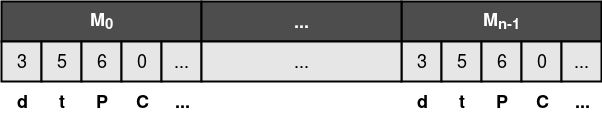

# CMU MARS (Aldrich), CP2: Code-Level Adaptation

## Overview

In this document, we outline a challenge problem that requires code-level
adaptation in response to source code perturbations. Our proposed challenge
problem involves semi-automatically injecting code-level perturbations into
the system, and alerting the code adaptation engine to the presence of a
code-level perturbation (but not necessarily the location of the
perturbation)
**We focus the scope of this challenge problem on
perturbations that mimic the kinds of changes that are introduced through
API migrations (e.g., method renaming, parameter addition, modification and
removal, change of units, etc.).**

The process of injecting perturbations is to be conducted by a third-party
(i.e., Lincoln Labs) with the aid of a perturbation engine, provided by
ourselves. Below, we provide a high-level overview of the external
evaluation process:

(1) The test harness sends a request to the perturbation engine, containing
a description of the characteristics of the desired perturbation. (2) The
perturbation engine generates a suitable perturbation at random, fitting
the characteristics provided in step (1), and injects it into the source
code. (3) The perturbation engine notifies the repair tool to the presence
of a perturbation, invoking the process of code-level adaptation. (4) The
code adaptation engine attempts to localise and adapt to the perturbation,
within a given time or resource limit specified by the examiner. (5) The
code adaptation engine provides a summary of the adaptation process to the
test harness.

Using this approach, we propose that Lincoln Labs assesses the ability of
the MARS system to self-adapt at the code-level by evaluating its response
to a set of generated code-level perturbation scenarios, inspired by
bugs observed in real-world robotics systems.

**To gain a more detailed understanding of the strengths and limitations of our
code-adaptation engine, we propose that the system be evaluated against
scenarios of varying levels of difficulty. For example, we may evaluate 60,
30 and 15 perturbation scenarios belonging to three coarsely defined
difficulty levels D1, D2 and D3, respectively. Each of these scenarios is
to be passed to the test harness to determine the system’s ability to
respond.**

### Approach

* Search-based program repair (greedy repair algos)
* We want to improve our understanding of the problem -- this is unchartered
  territory. What tools and techniques can we bring with us? Which of our
  assumptions fail to hold in reality? Lots of interesting findings.
* Emphasis on fault localisation and efficiency

### Motivation

**What is our motivation? Can we efficiently locate and fix realistic bugs
  in robotics software?**

### Research Questions

## Testing Procedure

**Note that no specific test data are required by this
challenge problem; all code-level perturbations will be generated using
our perturbation engine (discussed below) [MOVE THIS SOMEWHERE].**

**Need to discuss internal test suite and test outcomes.**

From a high-level perspective, the stages of the testing procedure for this
challenge problem are as follows.

1. **Generation:** A partial description of the perturbation scenario, provided
		by the examiner to the test harness, is forwarded onto the perturbation
		engine. The perturbation engine generates and returns a set of suitable
    code-level perturbations to the examiner, all of which satisify the
    specified characteristics.

2. **Injection:** The examiner selects one or more suitable perturbations
    from the set of suitable perturbations, and instructs the perturbation
    to inject those perturbations into the system.

3. **Validation:** The perturbed system is evaluated against the test suite to
    ensure that its behaviour is sufficiently degraded for at least one test
    (i.e., it must produce at least one `DEGRADED` or `FAILED` test outcome).
		If the set of perturbations do not produce a change in the outcomes of the
    test suite, the set of perturbations is discarded and the examiner is
    required to inject an alternative set of perturbations.
		(More details on “intent” and our evaluation metric can be found at a later
		section in this document).

4. **Adaptation:** Once a suitable perturbation has been injected, code-level
		adaptation is triggered. The code adaptation engine will attempt to find
    a code-level transformation that (partially) restores intent, within a set
    of specified resource limits. Once a suitable transformation has been
    found or resources have been exhausted, a summary of the repair trial is
    returned to the test harness. 

### Scenario Generation

Perturbation scenarios are encoded as a set of individual code-level
mutations, where each mutations is intended to represent a realistic
fault (in the context of a robotics system). Each of those constituent
faults is generated using our (soon-to-be-)open-source mutation testing
tool, Shuriken.

However, generating realistic faults remains an open challenge for both
robotics, and software systems in general [Just et al., 2014].
Using off-the-shelf mutation testing tools and operators can lead to
results that are not indicative of those that would be obtained by using
organic bugs [Pearson et al., 2017].

To counter this threat, we set out to better understand the nature of faults
in robotics systems. We conducted an empirical study of over 200 bugs in a
popular, open-source robotics system (ArduPilot). Based on our findings, we
crafted a set of bespoke mutation operators for Shuriken, designed to
replicate the ten most-frequently-encountered kinds of bugs.

* A (should be finished tallying results on Wednesday)
* B
* C
* D

Below, we describe parameters that are supplied to Shuriken by the test
harness to specify the characteristics of an individual perturbation.

| Name        | Description                                                    |
|-------------|----------------------------------------------------------------|
| File        | The name of the source code file that should be perturbed. |
| Mutation | The mutation operator that will be used to produce the perturbation. |

## Interface to the Test Harness (API)

The test harness will be provided by a simple RESTful server. This server
will implement two actions: 1) perturbation injection and 2) perturbation
status checking. The perturbation injection action will use the parameters
described in the “Test Parameters” section to generate a perturbation
scenario and begin its evaluation, and will return a unique identifier for
the scenario.  This identifier may be passed as an argument to the status
checking action to determine the current state of the evaluation for that
perturbation scenario.  This action will return a “status” property,
describing the state of the scenario using one of several predefined
labels. Each of these labels is described below, together with any
additional details that may be returned by the API.

### Sequence Diagram for Interaction Pattern

Implicitly, the TA can hit the `/error` endpoint on the TH at any time in
this sequence. This interaction is omitted for clarity.

### REST Interface to the TH

The Swagger file describing this interface is
[swagger-yaml/cp2-th.yaml](swagger-yaml/cp2-th.yaml) which should be
considered the canonical definition of the
API. [swagger-yaml/cp2-th.md](swagger-yaml/cp2-th.md) is produced
automatically from the Swagger definition for convenience.

### REST Interface to the TA

The Swagger file describing this interface is
[swagger-yaml/cp2-ta.yaml](swagger-yaml/cp2-ta.yaml) which should be
considered the canonical definition of the
API. [swagger-yaml/cp2-ta.md](swagger-yaml/cp2-ta.md) is produced
automatically from the Swagger definition for convenience.

## Intent Specification and Evaluation Metrics

To evaluate candidate code-level transformations, we propose that a set of
integration tests, each describing a mission for the robot (e.g.,
navigating a simulated corridor), be performed in simulation. Instead of
describing the outcome of a mission in terms of success or failure, we describe
outcomes in terms of a set of predefined quality-of-service (QoS) attributes
(e.g., distance from the target, power consumption, etc.).
We define the intent of the system in terms of its QoS attributes: a system
maintains intent if it completes a set of missions to a satisfactory level of
quality. If the system fails to meet this expected level of quality, we deem
it to be degraded. We define overall system quality as an approximate measure
of how closely the behaviour of a system meets its intent. This definition
allows us to recognise valuable adaptations that partially restore intent (e.g.,
switching to an alternative, less accurate navigation algorithm).

### Degradation

Given a test mission, we use an oracle to define a set of expected values for
each of the system's QoS attributes. We also use the oracle to determine a
suitable standard deviation for each of the QoS attributes. After performing
the test, the observed QoS values are compared against the expected values. If
the observed values are within one std. dev. of the expected value, intent is
said to have been maintained (with respect to a particular mission and QoS
metric). If the difference between the observed and expected values is greater
than one std. dev., the system is said to be *degraded*.

To simplify the measurement of overall system quality, and to account for
inherent measurement errors, the *degradation* of a particular QoS attribute for
a given mission is measured in units of standard deviation. Using this notion
of degradation, we measure the overall system degradation (in terms of a given
test suite) using a degradation matrix, shown below.

Naively, we can produce a scalar summary of the overall system degradation by
simply summing all values in the degradation matrix. Alternatively, we can
summarise system degradation using either a *QoS degradation vector* or a
*mission degradation vector*:

* The *QoS degradation vector* contains the sum of each column in the degradation
  matrix, and summarises the degradation of the system (across all tests) in
  terms of each of the QoS attributes.
* The *mission degradation vector* is given by the sum of each row in the
  degradation matrix, and describes the overall system degradation (across all
  QoS attributes) for each test.

### Quality of Service Attributes

We plan to measure quality of service using the following attributes:

* distance to target
* power consumption
* time taken
* number of collisions

Note, our approach is generic and can be easily extended to accommodate a
different set of attributes.

### Test Suite

Each test case, or mission, is described by the following:

* a mission schema, describing a kind of mission. (e.g., navigate to a
	location.)
* a set of mission parameters, required to instantiate the mission schema
	as a concrete mission. (e.g., move from A to B.)
* a simulated environment. (e.g., a randomly-generated maze.)
* a configuration for the robot. (e.g., a certain node may be disabled.)
* a set of quality of service metrics, defined by its schema, responsible for
	measuring the success of a mission.

This metric succinctly captures our goal for code-level adaptation: to
return a perturbed system as close to its intent as possible (or alternatively,
to reduce degradation).
From the perspective of the code-level adaptation engine, this metric also
transforms the problem into one that is more amenable to search (i.e., it
produces a gradient).

### Oracle

The expected quality of service for each attribute is determined by using the
unperturbed system as an oracle. After executing each mission several times,
the expected QoS values and standard deviations are calculated from the
observed results.

### Comparison to the Baseline

To compare the adaptive and non-adaptive behaviours of the system, we measure
the degradation of the pareto set of adaptations, found during the adaptive
case, against the degradation of the original system.

* *complete repair*: if the sum of the degradation matrix for a given
  adaptation is equal to zero (implying that intent was satisfied).
* *partial repair*: if any adaptation within the pareto set dominates the
  unadapted case in terms of degradation.
* *no repair*: if the adaptive case is unable to find an adaptation that
  dominates the unadapted case in terms of degradation.

## References

[Just et al., 2014] Just, R., Jalali, D., Inozemtseva, L., Ernst, M. D.,
Holmes, R., and Fraser, G. (2014).
Are mutants a valid substitute for real faults in software testing?.
In Proceedings of the 22nd ACM SIGSOFT International Symposium on Foundations of Software Engineering,
FSE '14. ACM.

[Pearson et al., 2017] Pearson, S., Campos, J., Just, R., Fraser, G., Abreu, R., Ernst,
M. D., Pang, D., and Keller, B. (2017). Evaluating and improving fault localization.
In Proceedings of the 2017 International Conference on Software Engineering, ICSE
’17. ACM.
