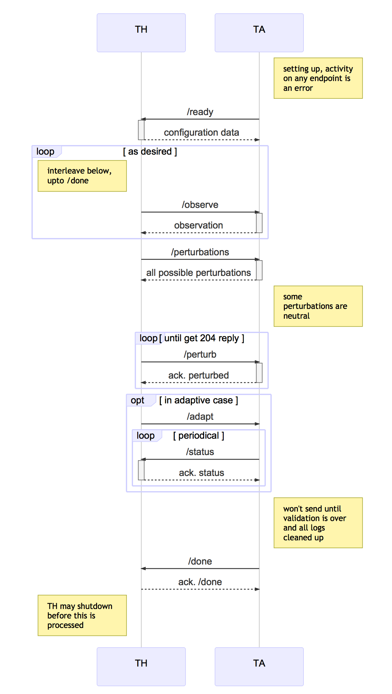

# CMU MARS (Aldrich), CP2: Code-Level Adaptation

## Overview

In this document, we outline a challenge problem that requires code-level
adaptation in response to source-code perturbations.

Our proposed challenge
problem involves semi-automatically injecting code-level perturbations into
the system, and alerting the code adaptation engine to the presence of a
code-level perturbation (but not necessarily the location of the
perturbation)

Using this approach, we propose that Lincoln Labs assesses the ability of
the MARS system to self-adapt at the code-level by evaluating its response
to a set of generated code-level perturbation scenarios, inspired by
bugs observed in real-world robotics systems.

### Motivation

**What is our motivation? Can we efficiently locate and fix realistic bugs
  in robotics software?**

### Approach

To tackle this challenge problem, we plan to construct a search-based program
repair technique, designed to efficiently fix common robotics bugs rather than
attempting to address all theoretically possible bugs.
We plan to construct this technique by bringing together several of our
innovations in the fields of fault detection, localisation and repair,
including but not limited to:

* A novel search algorithm, inspired by greedy algorithms, that reduces the
  cost repairing complex faults (i.e., multi-line faults) by several orders
  of magnitude compared to existing genetic-algorithm-based approaches.
* Automated (system-level) test generation for improving fault localisation
  accuracy and reducing the cost of testing.
* The use of an online mutation analysis, using the test results of candidate
  patches, to learn the shape and location over the course of the search.
* Elastic, distributed repair using commodity cloud-compute services, such as
  Amazon EC2, Microsoft Azure, and Google Compute Engine.

### Research Questions

This challenge problem is designed to answer the following research questions:

* **RQ1:** **[Fault localisation.]**
* **RQ2:** How often does search-based program repair discover a partial repair?
* **RQ3:** How often does search-based program repair discover a complete repair?

We want to improve our understanding of the problem -- this is unchartered
  territory. What tools and techniques can we bring with us? Which of our
  assumptions fail to hold in reality? Lots of interesting findings.

## Testing Procedure

In this section, we discuss the procedure for testing our proposed solution.

A high-level overview of the testing procedure for this challenge problem is
illustrated above. Below we briefly discuss each of the stages involved in this
procedure.

1. **Generation:** A partial description of the perturbation scenario, provided
		by the examiner to the test harness, is forwarded onto the perturbation
		engine. The perturbation engine generates and returns a set of suitable
    code-level perturbations to the examiner, all of which satisify the
    specified characteristics.

2. **Injection:** The examiner selects one or more suitable perturbations
    from the set of suitable perturbations, and instructs the perturbation
    to inject those perturbations into the system.

3. **Validation:** The perturbed system is evaluated against the test suite to
    ensure that its behaviour is sufficiently degraded for at least one test
    (i.e., it must produce at least one `DEGRADED` or `FAILED` test outcome).
		If the set of perturbations do not produce a change in the outcomes of the
    test suite, the set of perturbations is discarded and the examiner is
    required to inject an alternative set of perturbations.
		(More details on “intent” and our evaluation metric can be found at a later
		section in this document).

4. **Adaptation:** Once a suitable perturbation has been injected, code-level
		adaptation is triggered. The code adaptation engine will attempt to find
    a code-level transformation that (partially) restores intent, within a set
    of specified resource limits. 

5. **Summary:** Once the adaptation process has discovered a suitable
    transformation or has exhausted its available resources, a summary of the
    repair trial is communicated to the test harness. 

Note that unlike other challenge problems, our challenge problem does not
rely on any pre-defined test data. Instead, perturbations are generated (and
validated) dynamically by the test harness (via our TA API).
**[Is this true? Is our internal test suite considered to be test data?]**

### Scenario Generation

Perturbation scenarios are encoded as a set of individual code-level
mutations, where each mutations is intended to represent a realistic
fault (in the context of a robotics system). Each constituent
fault is generated using our (soon-to-be-)open-source mutation testing
tool, Shuriken.

However, generating realistic faults remains an open challenge for both
robotics, and software systems in general [Just et al., 2014].
Using off-the-shelf mutation testing tools and operators can lead to
results that are not indicative of those that would be obtained by using
organic bugs [Pearson et al., 2017].

To counter this threat, we set out to better understand the nature of faults
in robotics systems. We conducted an empirical study of over 200 bugs in a
popular, open-source robotics system (ArduPilot). Based on our findings, we
crafted a set of bespoke mutation operators for Shuriken, designed to
replicate the ten most-frequently-encountered kinds of bugs.

* A (should be finished tallying results on Wednesday)
* B
* C
* D

Below, we describe parameters that are supplied to Shuriken by the test
harness to specify the characteristics of an individual perturbation.

| Name        | Description                                                    |
|-------------|----------------------------------------------------------------|
| File        | The name of the source code file that should be perturbed. |
| Mutation | The mutation operator that will be used to produce the perturbation. |

## Interface to the Test Harness (API)

### Sequence Diagram for Interaction Pattern

Implicitly, the TA can hit the `/error` endpoint on the TH at any time in
this sequence. This interaction is omitted for clarity.

### REST Interface to the TH

The Swagger file describing this interface is
[swagger-yaml/cp2-th.yaml](swagger-yaml/cp2-th.yaml) which should be
considered the canonical definition of the
API. [swagger-yaml/cp2-th.md](swagger-yaml/cp2-th.md) is produced
automatically from the Swagger definition for convenience.

### REST Interface to the TA

The Swagger file describing this interface is
[swagger-yaml/cp2-ta.yaml](swagger-yaml/cp2-ta.yaml) which should be
considered the canonical definition of the
API. [swagger-yaml/cp2-ta.md](swagger-yaml/cp2-ta.md) is produced
automatically from the Swagger definition for convenience.

## Intent Specification and Evaluation Metrics

To evaluate candidate code-level transformations, we propose that a fixed suite
of tests, each describing a mission for the robot (e.g., to navigate a
simulated corridor), be performed in simulation.
Each test (or mission) within this suite is described by the following:

* a mission schema, describing a kind of mission. (e.g., navigate to a
	location.)
* a set of mission parameters, required to instantiate the mission schema
	as a concrete mission. (e.g., move from A to B.)
* a simulated environment. (e.g., a randomly generated maze.)
* a configuration for the robot. (e.g., a certain node may be disabled.)

Mission schemas are used to describe a certain type of mission
(e.g., point-to-point navigation) in terms of its
*parameters* (e.g., target location) and its expected *behaviours* (i.e., how
the mission is performed) and *outcomes* (i.e., the state of the robot
immediately after the execution of the mission).
Schemas are also responsible for classifying the outcome of a mission as either
*passing*, *failing*, or *degraded*, according to the degree to which the
robot behaves as expected by the schema.

Collectively, mission schemas are used to specify *intent* (i.e., the set of
intended behaviours of the robot in response to a mission). Test suites of
missions (i.e., instances of mission schemas) are used to approximately
measure whether intent is maintained by a particular version of the system.

### Comparison to Baseline

To measure the ability of our system to adapt to source-code perturbations, we
compare the test suite results of its *best* candidate adaptation (i.e., patch)
against those obtained by the unadapted, perturbed source code.
**[According to the BRASS terminology, we compare the following three versions
of the MARS system:]**

* **A:** Original source code (i.e., unperturbed case). Passes all tests.
* **B:** Mutated source code (i.e., perturbed case). Fails at least one test.
* **C:** Adapted source code (i.e., adaptive case).

The outcome of a perturbation scenario is evaluated according to the test suite
results of the three versions of the system:

* *complete repair*: if **(C)** passes all tests within the suite. (i.e.,
    **(C)** behaves identically to **(A)**, w.r.t. the test suite.)
* *partial repair*: if **(C)** dominates **(B)**.
* *no repair*: if **(C)** does not dominate **(B)**.

## References

[Just et al., 2014] Just, R., Jalali, D., Inozemtseva, L., Ernst, M. D.,
Holmes, R., and Fraser, G. (2014).
Are mutants a valid substitute for real faults in software testing?.
In Proceedings of the 22nd ACM SIGSOFT International Symposium on Foundations of Software Engineering,
FSE '14. ACM.

[Pearson et al., 2017] Pearson, S., Campos, J., Just, R., Fraser, G., Abreu, R., Ernst,
M. D., Pang, D., and Keller, B. (2017). Evaluating and improving fault localization.
In Proceedings of the 2017 International Conference on Software Engineering, ICSE
’17. ACM.
