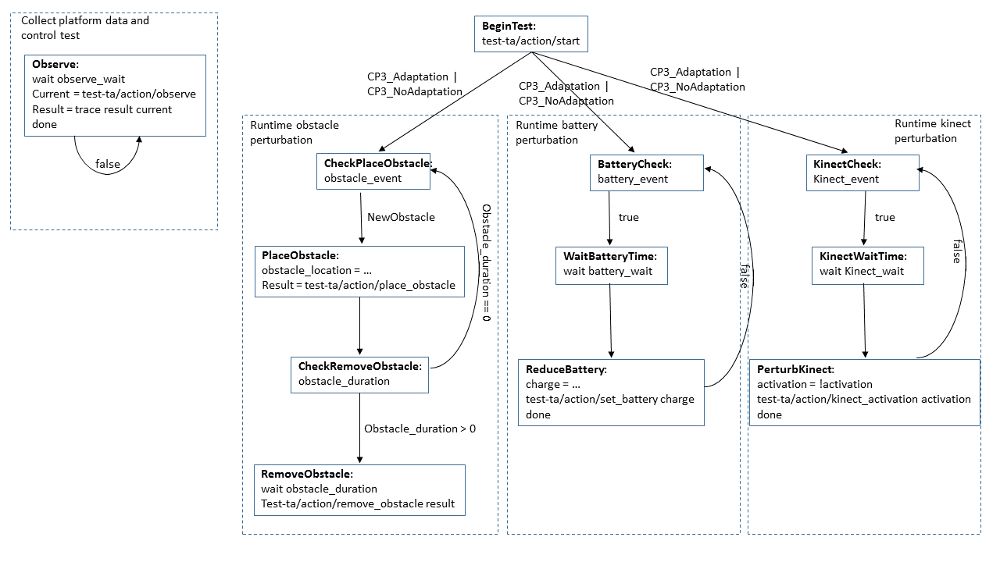
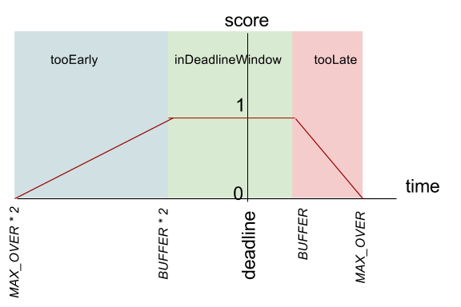

# CMU MARS (Alrdich), CP3: Robot obstacle avoidance, timeliness, power, and scale

## Overview

This challenge problem is an evolution of Phase I Challenge Problem 1 that will adapt the TurtleBot's use of sensors, components, 
and mission to current energy levels to preserve mission intent and intents regarding internal behavior despite low power and *changing 
hardware conditions*.

The robot is used for a variety of tasks with different mission parameters and different mission length. In its current form the 
TurtleBot implementation does not explicitly consider energy consumption and battery life, assuming the TurtleBot can drive back 
to its home station when the battery runs low. Various ecosystem and mission changes, from obstacles on the course, to delays in 
the mission, to partial sensor failure, can interfere with those objectives.

The DAS will use both offline and online techniques to prepare possible adaptations to ecosystem changes before the mission starts. 
It will perform adaptations online during the mission.

To successfully prepare and evaluate changes, the simulator requires a sensor on the system's current energy consumption, 
e.g., whole-system energy as measured by a power meter external to the computer running the simulation or part of the computer’s 
power supply, and as approximate power consumption of the individual sensors and actuators.

The key challenges being addressed in this challenge problem are:

* Scalabilility of online adaptation planning to realistic environments and concerns
* Uncertainty and its relationship to scale. There are various sources of uncertainty in this domain that could be included as probabilistic elements in planning; we are currently investigating the best one to use in the challenge problem. The candidates for uncertainty are:
    * Partial obstacle occlusion meaning that the robot might be able to adjust is clearance parameters to squeeze past an obstacle with some probability of hitting the obstacle.
    * Probabilistic information inherent in timing or power models.
    * Probability of obstacle permanence (i.e., will an obstacle that is placed in the path stay there or be removed soon?).
    * Uncertainty in localization from sensing.
* Technologies for adapting software configurations and algorithms on-line.

## Test Data

Lincoln Labs will be able to choose from a set of predefined maps that explore different aspects of scale and uncertainty. The selection will be part of the configuration data for the test. This will be done through a mnemonic in the configuration data.


## Test Parameters

* Start and target location
* Map mnemonic

```json
{
    "map_to_use" : MapMnemonic,
    "start_loc" : String,
    "target_loc" : String,
    "enable_adaptation" : "CP3_NoAdaptation" | "CP3_Adaptation",
}
```
> Jeff: I left off the optional other parameters from Phase 1 because they are redundant with the API, and were not used. You can always place an obstacle, set the charge, or turn off the kinect at any time.

## Test Procedure

The test procedure will be the same as for P1CP1, except that Lincoln labs will be able to perturb multiple times for each perturbation (e.g., place/remove obstacle, set battery, fail/reinstate kinect).


> Jeff: This is based on the diagram from last time. We're hoping to find a better tool to specify the state machine with. The intent is that you should be able to place (and optionally remove) obstacles simultaneously (i.e., place more than one obstacle at a time). But, this doesn't make sense for the charge and the kinect activation. Not sure how to represent this in this notation.

## Interface to the Test Harness (API)

```json
// Interface(s) from DAS/CP to test harness
// This POST message provides the status of the DAS and the system
// NOTE: Changed to use new interface
// NOTE: This is provided by the test harness -- DAS calls it
http://brass-th/ready
  {"TIME" : TIME_ENCODING}
http://brass-th/error
  {"TIME" : TIME_ENCODING, 
   "ERROR" : TEST_DATA_FILE_ERROR | TEST_DATA_FORMAT_ERROR | DAS_LOG_FILE_ERROR | DAS_OTHER_ERROR,
   "MESSAGE" : STRING_ENCODING}
http://brass-th/status
  {"TIME" : TIME_ENCODING,
   "STATUS" : PERTURBATION_DETECTED | MISSION_SUSPENDED | MISSION_RESUMED | MISSION_HALTED | MISSION_ABORTED | ADAPTATION_INITIATED | ADAPTATION_COMPLETED | ADAPTATION_STOPPED | TEST_ERROR,
   "MESSAGE" : { “msg” : STRING_ENCODING, “sim_time" : Integer }
  }
 
// a test action message that the TA may send to the TH to indicate that the mission is over before hitting time out.
// this message will be sent for one of two reasons: the bot is at the target location or the battery is about to die.
// other, more general, errors that cause the mission to end early will be reported by posting TEST_ERROR
http://brass-th/action/done
  {"TIME" : TIME_ENCODING,
   "TARGET" : STRING_ENCODING,
   "ARGUMENTS" :  { "done" : earlyTermReason }
  } 
// Interfaces from test harness to DAS/CP
// After ready is reported, the th will use this query to 
// get the initial planned path. note that waypoint names are unique.
// time gives a lower bound on the number of seconds we estimate to 
// traverse the path.
GET http://brass-ta/action/query_path
TEST_ACTION:
  {"TIME": TIME_ENCODING, "ARGUMENTS" : {}}
ACTION_RESULT:
  {"TIME": TIME_ENCODING, "RESULT" : {"path" : [String], "time" : Float}}
  
// Starts the TurtleBot navigating through the map for challenge problem 1
POST http://brass-ta/action/start
  {"TIME" : TIME_ENCODING, "ARGUMENTS" : {}}
 
// Note, we may add additional data to the arguments as they are needed
// for LL evaluation
GET http://brass-ta/action/observe
TEST_ACTION:
  {"TIME" : TIME_ENCODING, "ARGUMENTS" : {}}
ACTION_RESULT:
  {"TIME" : TIME_ENCODING, 
   "RESULT" : {"x" : Float, "y" : Float, "w" : Float, "v" : Float, "charge" : batteryLevel, "deadline" : Integer, "sim_time" : Integer, "kinect_status" : "on" | "off"}
  }
 
// API to set up the initial conditions for the experiment for power
POST http://brass-ta/action/set_battery
TEST_ACTION:
  {"TIME" : TIME_ENCODING,
   "ARGUMENTS" : {"charge" : batteryLevel}
  }
ACTION_RESULT:
  {"TIME" : TIME_ENCODING,
   "RESULT" : {"sim_time" : Integer}
  }
 
// tries to place an obstacle at the argument (x,y). if possible, returns a unique name for that obstacle and the (x,y)
// of the top left and bottom right corner of the unsafe region. 
POST http://brass-ta/action/place_obstacle
TEST_ACTION:
  {"TIME" : TIME_ENCODING,
   "ARGUMENTS" : {"x" : Float, "y" : Float}}
ACTION_RESULT:
  {"TIME" : TIME_ENCODING,
   "RESULT" : {"obstacleid" : STRING_ENCODING, topleft_x : Float, topleft_y : Float, botright_x : Float, botright_y : Float, "sim_time" : Integer }}
 
// removes an obstacle when given its name as returns from /action/place_obstacle
POST http://brass-ta/action/remove_obstacle
TEST_ACTION:
  {"TIME" : TIME_ENCODING,
   "ARGUMENTS" : {"obstacleid" : STRING_ENCODING}}
ACTION_RESULT:
  {"TIME" : TIME_ENCODING,
   "RESULT" : {"sim_time" : Integer}}
 
POST http://brass-ta/action/kinect_activation
TEST_ACTION:
  {"TIME" : TIME_ENCODING,
   "ARGUMENTS" : {"status" : "on" | "off"}
  }
ACTION_RESULT:
  {"TIME" : TIME_ENCODING,
   "RESULT" : {"sim_time" : Integer}
  }
```

## Intent Specification and Evaluation Metrics

### Intent Element 1: Accuracy
**Informal Description**: Robot comes to the target location.

**Formal Description**: The intent here is that if we get close to the goal (within 30cm from the center of the robot), then we get 1. Otherwise we get a linearly decreasing score the further away we are. So, if the turtlebot finishes in the green area in the figure below we get a score of 1; in the blue area we get 0 > score > 1; outside the blue circle we get 0.

**Test/Capture Method**: The position of the robot will be read from the simulator. This will be returned in test-ta/action/observed

**Verdict Expression**:

BUFFER = 50cm – the radius of the robot, plus some buffer that robotic algorithms determine as close enough
MAX_DISTANCE = 3m - The maximum distance from the buffer zone that can be considered near the target. 

function distance(loc1, loc2) = sqrt((loc1.x - loc2.x)^2 + (loc1.y - loc2.y)^2))

| Condition                                                        | Score                                             |
|------------------------------------------------------------------|---------------------------------------------------|
| eventually(distance(location,target) < BUFFER)	                | 1                                                 |
| eventually(BUFFER < distance(location, target) < MAX_DISTANCE)	 | 1-(distance(location,target)-BUFFER)/(MAX_DISTANCE+BUFFER) |
| else                                                             | 0                                                 |

**Challenge evaluation for degraded intents:**

C = the challenge (with adaptation on)
B = base (with no adaptation) 

DEG_C = the score (0..1) degraded of C
DEG_B = the score (0..1) degraded of B 

| C ->,<br/> B \/  | PASS              | DEGRADED                             | FAIL |
|-------------|-------------------|--------------------------------------|------|
| PASS        | INCONCLUSIVE      | FAIL                                 | FAIL |
| DEGRADED    | PASS              | PASS if DEG_C > DEG_B<br/>INCONCLUSIVE if DEG_C == DEG_B<br/>FAIL otherwise | FAIL |
| FAIL        | PASS | PASS | INCONCLUSIVE |

###Intent Element 2: Timing
**Informal Description**: Robot reaches target location by a deadline

**Formal Description**:

Scoring requirements:

1. Account for some inaccuracy (can’t be right on the deadline). Call this BUFFER
2. Being early is better than being late, but don’t want to encourage inaccurate over predictions. We can be early by 2*BUFFER or late by BUFFER
3. Want to penalize too many deadline predictions (so we don’t predict just before getting there). If there is no adaptation, then we can make one prediction. Let’s allow ourselves one more prediction per adaptation that we do. We will be penalized score*(1-over_predictions)^(3/2)/15. I.e., we get penalized more severely the more we over predict. A new prediction causes the robot to send a notification to the participant.



The above diagram gives the intent of the base score. If inDeadlineWindow, then we get 1. If too early, then we get less score, but at a slower rate (½) than if we are too late.
We’re allowed one prediction at the beginning of the test. So if there is one adaptation, then we expect two predictions.


**Test/Capture Method**: The running time of the test will be calculated starting when the test begins to when the mission is complete. The predicted deadline will be sent in the observations.

**Result Expression**: {(location, target, deadline, arrival_time, number_of_predictions, number_of_adaptations)}

**Verdict Expressions**:

BUFFER = 10 seconds
PENALTY = 120 seconds 

function close_enough (loc1, loc2) = distance (loc1, loc2) <= MAX_DISTANCE

// can be one minute late or two minutes early
function inDeadlineWindow(deadline, arrival) = arrival <= deadline + BUFFER and arrival > deadline-2*BUFFER

// 6 minutes early is ok, but more than two minutes gives us a degraded score
function tooEarly(deadline, arrival) = arrival <= deadline - 2*BUFFER

// 3 minutes late is ok, but later than one minutes gives us a degraded score
function tooLate(deadline, arrival) = arrival > deadline + BUFFER 

function prediction_penalty() = 1-(number_of_predictions - 1 - number_of_adaptations)^(3/2)/15

| Condition                                                      | Score                                                |
|---|---|
| eventually(close(location,target)  and inDeadlineWindow(deadline, arrival)) | 	1*prediction_penalty () |
| eventually(close(location,target)  and  tooEarly (deadline, arrival)) | prediction_penalty() * (arrival -  (deadline - 2 * (PENALTY+BUFFER)) /(2*PENALTY)) |
| eventually(close(location,target)  and tooLate(deadline, arrival)) | prediction_penalty() * ((arrival -  (deadline + PENALTY+BUFFER))  / (-PENALTY)) |
| else | 0 |


### Intent Element 3: Safety 

(If safety is in play for the uncertainty requirement, we will have an intent for this; otherwise, it will not be a factor)
