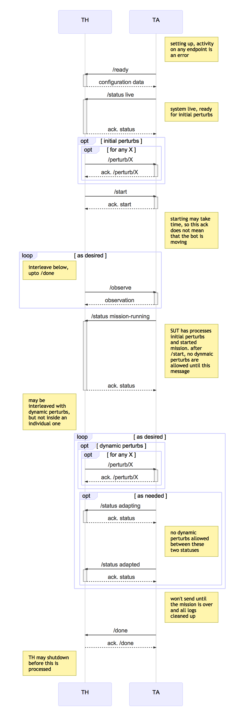

# CMU MARS (Aldrich), CP3: On-line robotic adaptation to software failure, unexpected environments

## Overview

This challenge problem will demonstrate major advances in our capability to adapt to perturbations such as software component failure or environmental change.

Today's self-adaptive systems are typically limited to selecting from pre-determined plans for adapting to specific responses.  In BRASS--and for long-lived software in general--these adaptations will need to be discovered when the system is in operation.  We use relational and probabilistic multi-objective planning to consider a wide range of adaptations including:
 * software configuration
 * software component parameters
 * mission adaptations

Changing software configuration on-line is difficult because components must be taken down and others restarted in an orderly way.  Most past work does not consider adaptations based on software configuration; the little work that does is based on pre-determined adaptation plans, not online discovery.  Prior work also has not considered combination of software configuration adaptations with parameter adaptation and mission adaptation; this creates both modeling and scalability challenges.

### Research Questions being Addressed

- Can the optimal architectural structure of a system (with respect to the satisfaction of mission goals) be generated with multi-objective planning? Can we use this to manage change to the structure of the software on-line?
- How can we manage the interplay between constraints on structure, behavior, and quality when adapting software?
- Modern CPS are a combination of models; how can we represent global constraints over multiple models and use them to help guarantee correctness and quality of software change plans?
- How accurate are the predicted effects of adaptations?
- What proportion of techniques can be used on line vs. needs to be done off-line?

### Exploring the Research Questions through the Test

The perturbations available to the test are designed to trigger software configuration changes that can be handled on-line (changes to actual code are being addressed in CP2). These perturbations will be drawn from the following set of possible perturbations: (a) Changing lighting conditions dynamically in the environment, (b) causing failure or error of a sensor on the robot, (c) placing obstacles in the path of the robot, (d) killing (with random amounts of persistence) software nodes on the robot. The aim here is explore a variety of difficulties of software configuration changes on-line, from relatively simple changes affecting one node (e.g., its resilience or parameterization) to nodes with a large number of dependencies, causing system-wide changes to the architecture structure of the software.

### Notes:
Changes available to the software:
- use of different, redundant sensor(s) for localization
- different localization techniques for different sensors and different parts of the map
- different map characteristics:
     - extensive glass corridors require ultrasound sensor and associated localization changes (rather than kinect)
     - large open space configured for poster session requires switch to SLAM, or different local planner for extensive obstacle avoidance. Different planners may have different degrees of reliability in the presence of crowds (e.g., follow-the-carrot is time optimal because it follows a straight line but less reliable than elastic band, because it does not adjust the trajectory of the robot in the presence of obstacles).
     - part of building with beacons requires reconfiguration to use them for localization, but the part of the software that makes use of them should not be running when not in that area.

## Test Data

No specific test data will be required for this challenge problem, other than that sent in response to the th/ready endpoint. The candidate maps will be delivered for inspection by Lincoln Labs. The maps will include (a) the graph of waypoints, indicating their location in meters from an origin, (b) properties associated with each edge and node (including whether it is a charging station, the lighting conditions along the path, and the crowdedness of the corridors).

>TODO: Need to be clear about what is known by the DAS (definitely waypoints and locations) and what is not (e.g., do we know up front the properties of the map - if not, which ones are hidden from us?) Perhaps a possibility would be adding knowledge with some degree of uncertainty (e.g., the existence of a crowd will be known with certainty once the robot gets close to it, but before that, the likelihood of a crowd in some part of the map is abstracted as a probability distribution - same for current light conditions).

## Test Parameters

The test will be able to be parameterized in a number of ways, and this will be done via the response to ready. The elements that may be specified for the test are:

- the map, chosen from a fixed set of generated maps. These maps will vary in their size (number of waypoints) and their environment (lighting conditions, area crowding in terms of obstacles)
- the initial robot position, as well as the target location for the robot, which constitutes the mission
- the initial robot configuration, in term of active sensors and navigation algorithm

## Test Procedure
> TODO
## Interface to the Test Harness (API)

### Sequence Diagram for Interaction Pattern

Implicitly, the TA can hit the `/error` endpoint on the TH at any time in
this sequence. This interaction is omitted for clarity.



### REST Interface to the TH

The Swagger file describing this interface is
[swagger-yaml/cp3-th.yaml](swagger-yaml/cp3-th.yaml) which should be
considered the canonical definition of the
API. [swagger-yaml/cp3-th.md](swagger-yaml/cp3-th.md) is produced
automatically from the Swagger definition for convenience.

### REST Interface to the TA

The Swagger file describing this interface is
[swagger-yaml/cp3-ta.yaml](swagger-yaml/cp3-ta.yaml) which should be
considered the canonical definition of the
API. [swagger-yaml/cp3-ta.md](swagger-yaml/cp3-ta.md) is produced
automatically from the Swagger definition for convenience.


## Intent Specification and Evaluation Metrics

### Intent Element 1: Accuracy
**Informal Description**: Robot comes to the target location.

**Formal Description**: The intent here is that if we get close to the goal (within 30cm from the center of the robot), then we get 1. Otherwise we get a linearly decreasing score the further away we are. So, if the turtlebot finishes in the green area in the figure below we get a score of 1; in the blue area we get 0 > score > 1; outside the blue circle we get 0.

**Test/Capture Method**: The position of the robot will be read from the simulator. This will be returned in test-ta/action/observed

**Verdict Expression**:

| Constant | likely value | meaning |
|----------|--------------|---------|
| BUFFER   | 50cm | the radius of the robot, plus some buffer that robotic algorithms determine as close enough |
| MAX_DISTANCE | 3m |  The maximum distance from the buffer zone that can be considered near the target. |

```
function distance(loc1, loc2) = sqrt((loc1.x - loc2.x)^2 + (loc1.y - loc2.y)^2))
```

| Condition                                                        | Score                                             |
|------------------------------------------------------------------|---------------------------------------------------|
| eventually(distance(location,target) < BUFFER)	                | 1                                                 |
| eventually(BUFFER < distance(location, target) < MAX_DISTANCE)	 | 1-(distance(location,target)-BUFFER)/(MAX_DISTANCE+BUFFER) |
| else                                                             | 0                                                 |

**Challenge evaluation for degraded intents:**

C = the challenge (with adaptation on)
B = base (with no adaptation)

DEG_C = the score (0..1) degraded of C
DEG_B = the score (0..1) degraded of B

| C ->,<br/> B \/  | PASS              | DEGRADED                             | FAIL |
|-------------|-------------------|--------------------------------------|------|
| PASS        | INCONCLUSIVE      | FAIL                                 | FAIL |
| DEGRADED    | PASS              | PASS if DEG_C > DEG_B<br/>INCONCLUSIVE if DEG_C == DEG_B<br/>FAIL otherwise | FAIL |
| FAIL        | PASS | PASS | INCONCLUSIVE |

###Intent Element 2: Timing
**Informal Description**: Robot reaches target location by a deadline

**Formal Description**:

Scoring requirements:

1. Account for some inaccuracy (can’t be right on the deadline). Call this BUFFER
2. Being early is better than being late, but don’t want to encourage inaccurate over predictions. We can be early by 2*BUFFER or late by BUFFER
3. Want to penalize too many deadline predictions (so we don’t predict just before getting there). If there is no adaptation, then we can make one prediction. Let’s allow ourselves one more prediction per adaptation that we do. We will be penalized score*(1-over_predictions)^(3/2)/15. I.e., we get penalized more severely the more we over predict. A new prediction causes the robot to send a notification to the participant.


The above diagram gives the intent of the base score. If inDeadlineWindow, then we get 1. If too early, then we get less score, but at a slower rate (½) than if we are too late.
We’re allowed one prediction at the beginning of the test. So if there is one adaptation, then we expect two predictions.


**Test/Capture Method**: The running time of the test will be calculated starting when the test begins to when the mission is complete. The predicted deadline will be sent in the observations.

**Result Expression**: {(location, target, deadline, arrival_time, number_of_predictions, number_of_adaptations)}

**Verdict Expressions**:

| Constant | likely value | meaning |
|----------|--------------|---------|
| BUFFER   | 10 seconds   | TODO    |
| PENALTY  | 120 seconds  | TODO    |

```
function close_enough (loc1, loc2) = distance (loc1, loc2) <= MAX_DISTANCE


// can be one minute late or two minutes early
function inDeadlineWindow(deadline, arrival) = arrival <= deadline + BUFFER and arrival > deadline-2*BUFFER

// 6 minutes early is ok, but more than two minutes gives us a degraded score
function tooEarly(deadline, arrival) = arrival <= deadline - 2*BUFFER

// 3 minutes late is ok, but later than one minutes gives us a degraded score
function tooLate(deadline, arrival) = arrival > deadline + BUFFER

function prediction_penalty() = 1-(number_of_predictions - 1 - number_of_adaptations)^(3/2)/15
```

| Condition                                                      | Score                                                |
|---|---|
| eventually(close(location,target)  and inDeadlineWindow(deadline, arrival)) | 	1*prediction_penalty () |
| eventually(close(location,target)  and  tooEarly (deadline, arrival)) | prediction_penalty() * (arrival -  (deadline - 2 * (PENALTY+BUFFER)) /(2*PENALTY)) |
| eventually(close(location,target)  and tooLate(deadline, arrival)) | prediction_penalty() * ((arrival -  (deadline + PENALTY+BUFFER))  / (-PENALTY)) |
| else | 0 |


### Intent Element 3: Safety

(If safety is in play for the uncertainty requirement, we will have an intent for this; otherwise, it will not be a factor)
