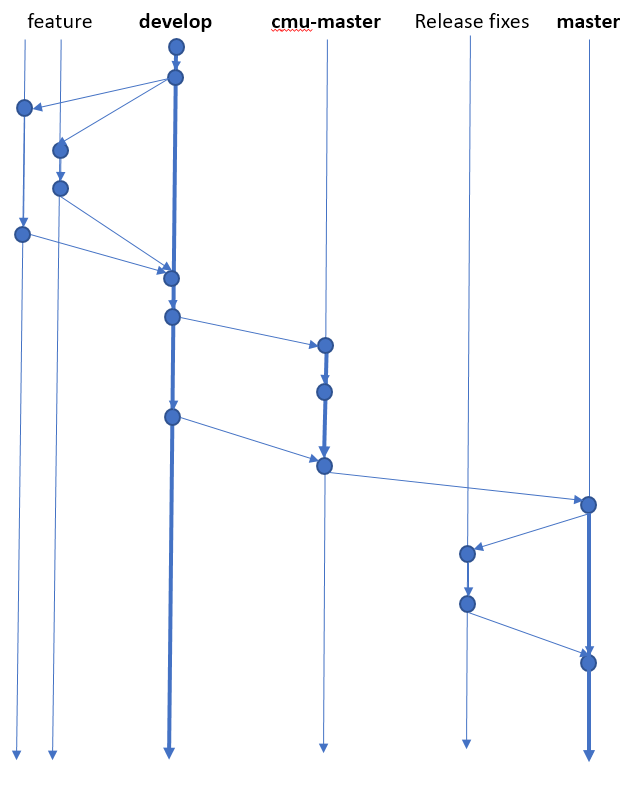

# Git Polices for CMU Mars repository

This repository contains the code that is pertinent to the development and release of BRASS challenge problems to Lincoln Labs. As such, it should contain the following kinds of things:

1. Docker container definitions that are pertinent to the integration with Lincoln Labs
2. Challenge problem definitions and discussion
3. Policies and Procedures

Note that this repository is not intended to contain *all* BRASS code. Other code may exist in different repositories but will be merged in here for integration and release.

This document describes the Git process that should be followed in this repository.

## Git branching policy

The policy described here is inspired by the GitFlow policy that can be found [here](https://datasift.github.io/gitflow/IntroducingGitFlow.html). A summary of the process is included in the image above. There are three permanent branches:

1. **develop**: This branch is for internal development and integration among different teams. Teams can create feature branches off of this for working changes, new features, etc. For example, if a significant change is warranted to a challenge problem description, a new feature branch for the change should be created, wherein internal development can proceed. Once the developer is happy with the changes, it should be merged back into development, where it may go through wider review among the team developing challenge problems.
2. **cmu-master**: This branch is for code/documentation that is intended for (a) wide review by all the PIs in the team and (b) integration staging and testing before release to Lincoln labs. For example, if a developer wants to have the challenge problem definition reviewed by all CMU participants, then they should merge from the development branch into the cmu-master branch. The latest version in this branch will be the one required for review.
3. **master**: This branch is solely for tagging releases for Lincoln Labs to examine, or for them to evaluate and test. RR releases will be tagged here. During integration with LL, a branch of the tag will be created for fixes to the code. These will be merged into new releases in master. Some of these will be pulled back into **cmu-master** and **develop** once the integration is successful.

To summarize the intent, if a developer or team wishes to add a feature to some part of the repository, they should do the following:

1. Create a branch from **develop** that will contain the deveopment of this new feature.
2. Merge into **develop** for internal review and testing
3. Merge into **cmu-master** for CMU review and integratino testing. This branch should always build, and will likely be the branch that is used for CI.
4. Once CMU integration testing or review is complete, **cmu-master** will be merged into **master** and tagged for release to LL. This will not be done by the developer, but will likely be done by the CMU-LL Integration team (e.g., Ian, Bradley, or Josh)
5. CMU-LL Integration will create a release branch which will contain fixes that might come up when LL tries to use this. At the same time, they will merge these fixes back into **develop** and **cmu-master** so that problems aren't reintroduced to **master** in subsequent releases.
